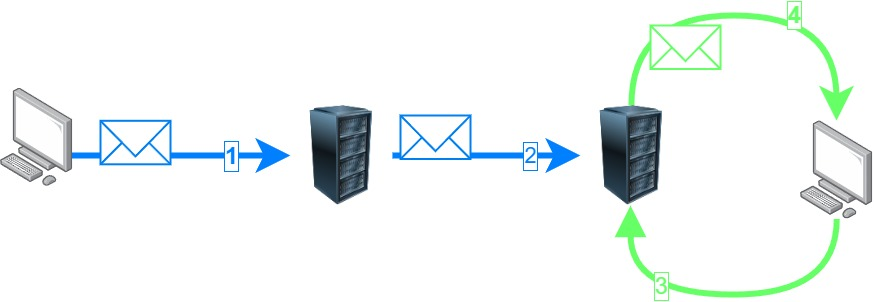

# La messagerie

La messagerie est un composant essentiel dans la vie numérique, privé tout comme professionnel. Elle repose sur un ensemble de serveurs ainsi que 3 principaux protocoles SMTP, IMAP et POP.

# Description d’un flux de courrier

Quand vous envoyer un email, votre application envoie un paquet *(SMTP)* vers votre serveur *(google pour les adresse Gmail, Microsoft pour Outlook …)* puis le serveur se charge de le transmettre au serveur de votre destinataire *(toujours en SMTP)* et enfin votre destinataire viens récupérer les mails sur le serveur *(protocole POP ou IMAP)*. 

A oui chaque serveur ce réserve le droit de filtré ou non le message.

# L’adresse mail

L’adresse mails permet de spécifier un destinataire ou un expéditeur. Comme dans la vraie vie quand vous envoyez un courriel, vous devez spécifier votre adresse entant qu’expéditeur.
Cette opération est transparente lorsque vous écrivez un mail (c’est l’application qui s’en charge). 

Le format d’une adresse mail est le suivant : **quelquechose@domaine.fr
domaine.fr peut être remplacé par gmail.com, outlook.com, free.fr, votreentreprise.fr…** Le nom de domaine permet aux serveurs de rechercher le serveur de messagerie de destination.
Le **quelquechose** avant le symbole **@** permet au serveur de destination d’associer le mail a votre boîte mail.

# La boîte mail

C’est un dossier sur le serveur dans lequel tous vos mail sont rangés. il y a des sous dossier par défauts dans lesquels sont placé vos e-mail (boîte de réception, spams, brouillons, éléments envoyés…) La plus part des fournisseur de boîte mail vous permettent de créer vos dossiers personnaliser dans lesquels vous placerez manuellement ou à l’aide de filtre/règles vos e-mail.

Pour ce connecter a une boîte mail, vous aurez besoin de l’adresse mail associer a la boîte ainsi que d’un mot de passe (qui a été créer lors de la création de l’adresse et de la boîte).

**Je vous conseil, ORDONNE d’activer la double authentification ainsi que de changer régulièrement votre mot de passe.**

# Les boîtes aux lettre partager

Les boîtes aux lettre partager (BAL partagé), sont des boîtes mails accessible par plusieurs utilisateurs. Elles fonctionne vraiment comme des boîtes mail sauf que pour y accéder vous n’avez pas besoin de faire la moindre connexion. Une fois les droits d’accès donné par un administrateur, la boîte apparait sur le compte de l’utilisateur. 

## Choses a revoir car je ne suis plus sûr

- Vérifier si les mails de la BAL partagé sont stocker à part ou dans l’OST de chaque user 
(sur un client)
- Vérifier ou sont stocker les mails envoyé entant que balpartage@domaine.fr

# Les listes de Diffusions

Une liste de diffusion, est une adresse mail qui quand elle reçoit un mail renvoi le mail a tous les membres de liste.
Ex : On peut créer une adresse *allentreprise@domaine.fr* pour notifier rapidement tous les membre de l’entreprise d’une information (nouvelle politiques de sécurité, évènements…).

La diffusion peu être autoriser uniquement pour les membre du domaine (*@domaine.fr*), une adresse/un groupe d’adresses, un domaine externe (*@unautredomaine.com*) ou bien a tout le monde.

# POP vs IMAP

Lors de la configuration de certain client mail ou lors des configurations avancées. Il faut choisir le protocole POP ou IMAP ? réponse rapide IMAP dans 90% des cas.

Pour rappel ces deux protocoles permettent de récupérer les mails sur un serveur de messagerie.

## Le protocole POP

**Les mails sont rapatrié sur le poste clients. Ils “disparaissent” du serveur**. à l’heure actuelle je préconiserait son utilisation dans les cas ou le serveur de messagerie aurait une capacité de stockage limité. Ex : vous utiliser les forfait mails basiques des hébergeur web 1-2GO.
Quand vous utilisé ce protocole vous ne pouvez pas consulté vos mail sur plusieurs appareils; plutôt les mails chargés par un appareil ne peuvent pas être chargés par les autres (ils ne sont plus sur le serveur). Si vous compromettez le poste sur le quel les mails sont enregistré vous perdez tout sans possibilité de récupération (si vous l’utilisez faites des sauvegardes)…

## Le protocole IMAP

**Les mails sont synchroniser entre le poste et le serveur. les mails restent présent sur le serveur.** Pour moi c’est LE protocole à utiliser. Il permet l’utilisation de plusieurs appareils, permet de limité l’espace utiliser sur les poste client (pas obligé de tout synchroniser). La seule limite a ce protocole sera la capacité de stockage sur le(s) serveur(s) accordé a chaque utilisateur.

⚠ Les deux protocoles s’occupe **uniquement de la synchronisation des mails**, pas de contacts, pas de calendrier… pour ça il existe des protocoles propriétaire comme **MAPI** (Microsoft) qui synchronise plus d’information.

# Aller plus loin

Todo - Des fiches qui entre un peu plus en détail sur le fonctionnement des serveurs de messagerie, des protocoles…  

- Fonctionnement d’un server de messagerie
- Configuration d’un server de messagerie (Microsoft Exchange)
- Configuration d’un server de messagerie (Linux Postfix)
- OST | PST | OLM

# Les protocoles

[SMTP](../Protocols/SMTP.md)

[POP](../Protocols/POP.md)

[IMAP](../Protocols/IMAP.md)

[MAPI](../Protocols/MAPI.md)